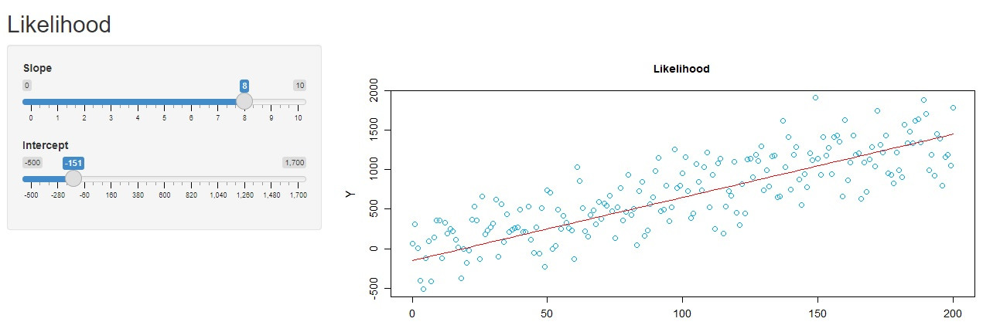

### **Parameter estimation in statistical models**

This R script presents implementations and discussion on parameter estimation (optimization) methods for statistical models, including both matricial and analytical solutions, and Maximum Likelihood (ML) estimation. The code incorporates a Shiny app for interactive exploration and a 3D surface plot is generated using kernel density estimation (KDE) with the plotly package.

Ensure the required R packages (shiny, stats4, plotly, MASS) are installed.

The script sources an external Shiny app file (app_likelihood.R) to run the Shiny application. Explore the interactive features provided by the app.

And also explore the search space using the 3D surface plot:

[Link to 3D Surface Plot](docs/3dsurf.html)
